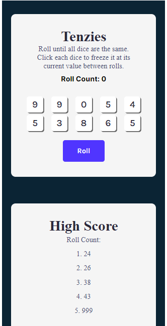

# This is Tenzies, a game that test your luck

<h1>Rules</h1>
The goal of the game is try to make all the number become the same number.  
The player can change the numbers on the screen to random number by clicking the roll button. 
The player can stop the dice from rolling by clicking on it. 
 
The lower your roll count, the better your result is. 
Try get a better score :D 
 
Good Luck and have FUN :D 
 

